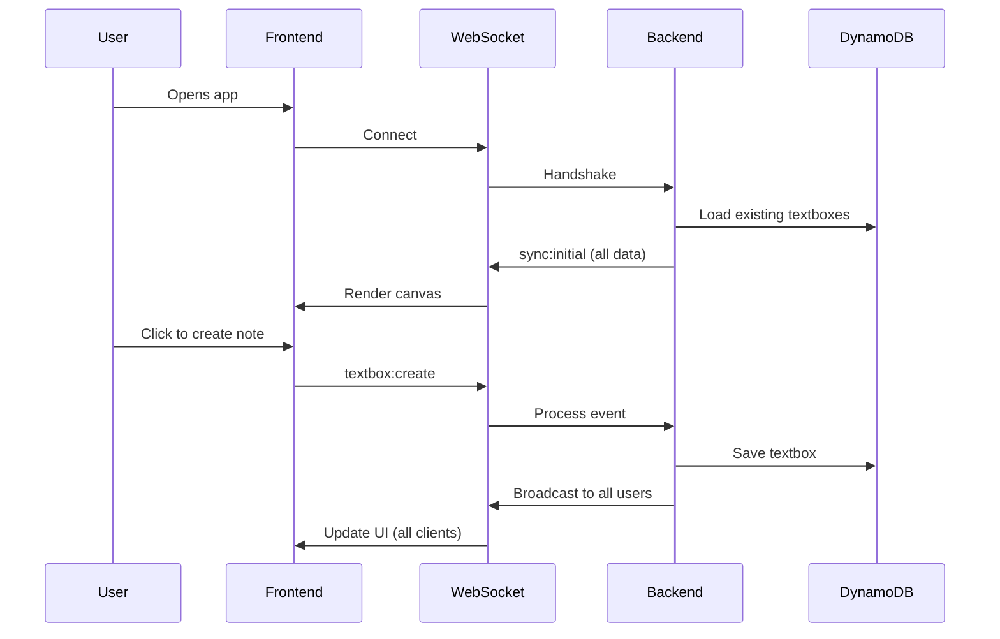

# 🌌 Contextual Space

> A real-time collaborative canvas where users can place, edit, and share text notes in a shared 2D space. Think of it as a multiplayer whiteboard meets sticky notes.

**🌐 Live Demo**: [https://d3q2b06rnr38b0.cloudfront.net](https://d3q2b06rnr38b0.cloudfront.net)

---

## ✨ Features

| Feature | Description |
|---------|-------------|
| 🎯 **Real-time Collaboration** | See other users' cursors and notes appear instantly |
| 📝 **Text Notes** | Click anywhere to place a note, double-click to edit |
| 🎨 **User Colors** | Each user gets a unique color for easy identification |
| 🔒 **Reserved Areas** | Create private zones that hide content from others |
| 🔍 **Search & Filter** | Find notes by username or content |
| 📱 **Mobile Friendly** | Touch support for dragging notes on mobile devices |
| ♾️ **Infinite Canvas** | Pan and scroll in any direction |
| 💾 **Persistent Storage** | Notes survive server restarts (DynamoDB) |

---

## 🏗️ Architecture

```
┌─────────────────────────────────────────────────────────────────────────────┐
│                              USERS                                          │
│                         (Browser/Mobile)                                    │
└─────────────────────────────────────────────────────────────────────────────┘
                                    │
                                    ▼
┌─────────────────────────────────────────────────────────────────────────────┐
│                           AWS CloudFront                                    │
│                     (CDN - Global Edge Locations)                           │
│                      d3q2b06rnr38b0.cloudfront.net                          │
└─────────────────────────────────────────────────────────────────────────────┘
                    │                                    │
                    ▼                                    ▼
┌────────────────────────────┐          ┌────────────────────────────────────┐
│         AWS S3             │          │        AWS App Runner              │
│   (Static Frontend)        │          │    (Backend Container)             │
│                            │          │                                    │
│  • React 18 + TypeScript   │          │  • Node.js + Express               │
│  • Vite + Tailwind CSS     │◄────────►│  • Socket.IO (WebSockets)          │
│  • Single Page App         │          │  • Real-time events                │
│                            │          │                                    │
└────────────────────────────┘          └────────────────────────────────────┘
                                                         │
                                                         ▼
                                        ┌────────────────────────────────────┐
                                        │        AWS DynamoDB                │
                                        │    (NoSQL Database)                │
                                        │                                    │
                                        │  • TextBoxes table                 │
                                        │  • On-demand capacity              │
                                        │  • Global Secondary Index          │
                                        │                                    │
                                        └────────────────────────────────────┘
```

### Data Flow



---

## 🚀 Quick Start

### Prerequisites

- **Node.js 20+**
- **Docker** (optional, for containerized development)
- **AWS CLI** (for deployment)
- **Terraform** (for infrastructure)

### Local Development

```bash
# Clone the repository
git clone https://github.com/NikolaGospodjinacki/Contextual_Space.git
cd Contextual_Space

# Terminal 1 - Start Backend
cd backend
npm install
npm run dev

# Terminal 2 - Start Frontend
cd frontend
npm install
npm run dev
```

Open [http://localhost:5173](http://localhost:5173) in your browser.

### Docker Development

```bash
docker-compose up --build
```

---

## 📁 Project Structure

```
Contextual_Space/
├── 📂 backend/                 # Node.js + Express + Socket.IO
│   ├── src/
│   │   ├── index.ts           # Server entry point
│   │   ├── socket/
│   │   │   └── handlers.ts    # WebSocket event handlers
│   │   ├── store/
│   │   │   ├── index.ts       # Hybrid in-memory + DynamoDB store
│   │   │   └── dynamodb.ts    # DynamoDB client
│   │   ├── types/
│   │   │   └── index.ts       # TypeScript interfaces
│   │   └── utils/
│   │       └── colors.ts      # User color generation
│   ├── Dockerfile
│   ├── package.json
│   └── tsconfig.json
│
├── 📂 frontend/                # React + Vite + Tailwind
│   ├── src/
│   │   ├── App.tsx            # Main app component
│   │   ├── components/
│   │   │   ├── Canvas.tsx     # Main canvas with all logic
│   │   │   ├── TextBox.tsx    # Draggable text note
│   │   │   ├── OtherCursor.tsx # Other users' cursors
│   │   │   └── UsernameModal.tsx
│   │   ├── hooks/
│   │   │   └── useSocket.ts   # Socket.IO React hook
│   │   ├── services/
│   │   │   ├── socket.ts      # Socket.IO client wrapper
│   │   │   └── sound.ts       # Audio feedback
│   │   ├── types/
│   │   │   └── index.ts       # Shared TypeScript types
│   │   └── utils/
│   │       └── collision.ts   # Position collision detection
│   ├── Dockerfile
│   ├── package.json
│   ├── vite.config.ts
│   └── tailwind.config.js
│
├── 📂 infrastructure/          # Terraform IaC
│   └── terraform/
│       ├── main.tf            # Provider config
│       ├── apprunner.tf       # App Runner service
│       ├── dynamodb.tf        # DynamoDB table
│       ├── ecr.tf             # Container registry
│       ├── s3_cloudfront.tf   # Frontend hosting
│       ├── iam.tf             # IAM roles & policies
│       ├── github_oidc.tf     # GitHub Actions OIDC
│       ├── variables.tf       # Input variables
│       ├── outputs.tf         # Output values
│       └── terraform.tfvars   # Variable values (gitignored)
│
├── 📂 .github/workflows/       # CI/CD Pipelines
│   ├── deploy-backend.yml     # Backend: Docker → ECR → App Runner
│   └── deploy-frontend.yml    # Frontend: Build → S3 → CloudFront
│
├── 📂 docs/                    # Documentation
│   ├── ARCHITECTURE.md        # Detailed architecture docs
│   ├── INFRASTRUCTURE.md      # AWS resource details
│   └── CONTRIBUTING.md        # Developer guide
│
├── docker-compose.yml          # Local Docker setup
├── .gitignore
└── README.md
```

---

## 🛠️ Tech Stack

| Layer | Technology | Purpose |
|-------|------------|---------|
| **Frontend** | React 18, TypeScript | UI framework |
| | Vite | Build tool & dev server |
| | Tailwind CSS | Styling |
| | Socket.IO Client | Real-time communication |
| **Backend** | Node.js, Express | HTTP server |
| | Socket.IO | WebSocket server |
| | TypeScript | Type safety |
| | AWS SDK v3 | DynamoDB client |
| **Database** | AWS DynamoDB | NoSQL persistence |
| **Infrastructure** | AWS App Runner | Container hosting |
| | AWS S3 | Static file hosting |
| | AWS CloudFront | CDN |
| | AWS ECR | Container registry |
| **CI/CD** | GitHub Actions | Automated deployments |
| | OIDC | Secure AWS auth (no keys!) |
| **IaC** | Terraform | Infrastructure as Code |

---

## 🔐 Security

- **No AWS Access Keys in GitHub** - Uses OIDC federation for secure authentication
- **Least Privilege IAM** - Each component has minimal required permissions
- **HTTPS Everywhere** - CloudFront enforces HTTPS
- **CORS Configured** - Backend only accepts requests from known origins

---

## 🚀 Deployment

### CI/CD (Recommended)

Deployments are fully automated via GitHub Actions:

| Trigger | Pipeline | Duration |
|---------|----------|----------|
| Push to `backend/**` | `deploy-backend.yml` | ~4 minutes |
| Push to `frontend/**` | `deploy-frontend.yml` | ~30 seconds |

Just push to `main` and the appropriate pipeline runs automatically!

### Manual Deployment

```bash
# Backend
cd backend
npm run build
docker build -t contextual-space-backend .
docker tag contextual-space-backend:latest 871981698300.dkr.ecr.us-east-1.amazonaws.com/contextual-space-backend:latest
aws ecr get-login-password --region us-east-1 | docker login --username AWS --password-stdin 871981698300.dkr.ecr.us-east-1.amazonaws.com
docker push 871981698300.dkr.ecr.us-east-1.amazonaws.com/contextual-space-backend:latest

# Frontend
cd frontend
npm run build
aws s3 sync dist s3://contextual-space-frontend-dev-871981698300 --delete
aws cloudfront create-invalidation --distribution-id E2V9NWK252L441 --paths "/*"
```

### Infrastructure Changes

```bash
cd infrastructure/terraform
terraform init
terraform plan -var-file=terraform.tfvars
terraform apply -var-file=terraform.tfvars
```

### Destroy Infrastructure

To tear down all AWS resources and reduce costs to $0:

**Via GitHub Actions (Recommended):**
1. Go to **Actions** → **Destroy Infrastructure**
2. Click **Run workflow**
3. Type `DESTROY` to confirm
4. Wait for completion (~2-3 minutes)

**Via Terminal:**
```bash
cd infrastructure/terraform
terraform destroy -var-file=terraform.tfvars
```

> ⚠️ This will delete all data. Infrastructure can be recreated with `terraform apply`.

---

## 💰 Cost Breakdown

| Resource | Monthly Cost | Notes |
|----------|--------------|-------|
| App Runner | $5-10 | 1 min instance (always warm) |
| DynamoDB | $0-1 | On-demand, pay per request |
| S3 | <$1 | Static files only |
| CloudFront | $0-2 | 1TB free tier |
| ECR | <$1 | Image storage |
| **Total** | **~$7-15/month** | For low-traffic POC |

---

## 📝 API Reference

### WebSocket Events

| Event | Direction | Payload | Description |
|-------|-----------|---------|-------------|
| `user:join` | Client → Server | `{ username }` | Join the canvas |
| `sync:initial` | Server → Client | `{ textboxes, cursors, reservations }` | Initial state |
| `textbox:create` | Client → Server | `{ content, positionX, positionY }` | Create a note |
| `textbox:created` | Server → All | `TextBox` | Note created |
| `textbox:update` | Client → Server | `{ id, content?, positionX?, positionY? }` | Update a note |
| `textbox:updated` | Server → All | `TextBox` | Note updated |
| `textbox:delete` | Client → Server | `{ id }` | Delete a note |
| `textbox:deleted` | Server → All | `{ id }` | Note deleted |
| `cursor:move` | Client → Server | `{ x, y }` | Cursor position |
| `cursor:moved` | Server → Others | `CursorPosition` | Other's cursor |
| `reservation:create` | Client → Server | `{ x, y, width, height, isHidden }` | Create reserved area |
| `reservation:update` | Client → Server | `{ id, isHidden }` | Toggle visibility |
| `reservation:delete` | Client → Server | `{ id }` | Delete reserved area |

---

## 🤝 Contributing

See [docs/CONTRIBUTING.md](docs/CONTRIBUTING.md) for development guidelines.

---

## 📜 License

MIT License - see [LICENSE](LICENSE) for details.

---

## 🙏 Acknowledgments

Built as a DevOps learning project to practice:
- Agentic AI-assisted development (GitHub Copilot)
- AWS infrastructure with Terraform
- CI/CD with GitHub Actions
- Real-time WebSocket applications
- Docker containerization

---

<p align="center">
  Made with ❤️ and ☕ by <a href="https://github.com/NikolaGospodjinacki">Nikola Gospodjinacki</a>
</p>
