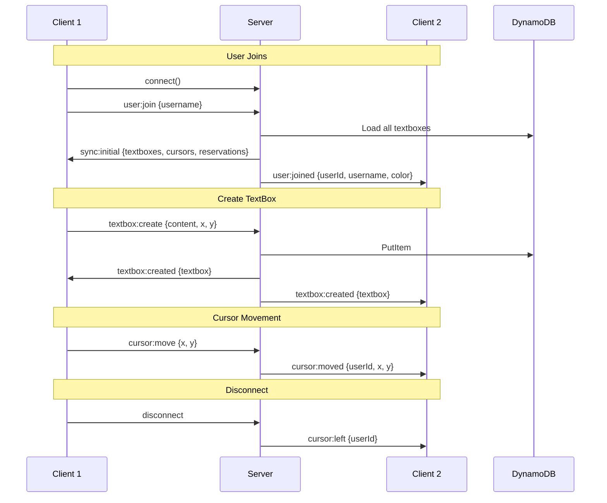

# 🏗️ Architecture Documentation

This document provides a detailed technical overview of the Contextual Space application architecture.

---

## System Overview

Contextual Space is a real-time collaborative canvas application that allows multiple users to simultaneously place, edit, and view text notes in a shared 2D space.

### High-Level Architecture

```
┌─────────────────────────────────────────────────────────────────────────────────────────┐
│                                    INTERNET                                              │
└─────────────────────────────────────────────────────────────────────────────────────────┘
                                         │
                    ┌────────────────────┴────────────────────┐
                    │                                         │
                    ▼                                         ▼
    ┌───────────────────────────┐           ┌───────────────────────────────────────────┐
    │     CloudFront CDN        │           │           App Runner                      │
    │  (Edge Locations)         │           │    ┌─────────────────────────────────┐    │
    │                           │           │    │      Container Instance         │    │
    │  ┌─────────────────────┐  │           │    │  ┌───────────────────────────┐  │    │
    │  │    S3 Bucket        │  │           │    │  │   Express + Socket.IO    │  │    │
    │  │  (React SPA)        │◄─┼───────────┼────┼──│   Node.js Server         │  │    │
    │  │                     │  │  WebSocket│    │  │                          │  │    │
    │  │  - index.html       │  │  (wss://) │    │  │  Port 3001               │  │    │
    │  │  - assets/*.js      │  │           │    │  └───────────────────────────┘  │    │
    │  │  - assets/*.css     │  │           │    │              │                  │    │
    │  └─────────────────────┘  │           │    └──────────────┼──────────────────┘    │
    └───────────────────────────┘           │                   │                       │
                                            └───────────────────┼───────────────────────┘
                                                                │
                                                                ▼
                                            ┌───────────────────────────────────────────┐
                                            │           DynamoDB                        │
                                            │                                           │
                                            │  Table: contextual-space-textboxes-dev    │
                                            │  Partition Key: type                      │
                                            │  Sort Key: id                             │
                                            │                                           │
                                            │  GSI: UserIdIndex                         │
                                            │  Partition Key: userId                    │
                                            └───────────────────────────────────────────┘
```

---

## Component Details

### Frontend (React SPA)

**Location**: `frontend/`

**Technology Stack**:
- React 18 with TypeScript
- Vite (build tool)
- Tailwind CSS (styling)
- Socket.IO Client (WebSocket)

**Key Components**:

| Component | File | Responsibility |
|-----------|------|----------------|
| `Canvas` | `components/Canvas.tsx` | Main canvas, drag selection, reserved areas, search |
| `TextBox` | `components/TextBox.tsx` | Individual text note with drag/edit/delete |
| `OtherCursor` | `components/OtherCursor.tsx` | Display other users' cursor positions |
| `UsernameModal` | `components/UsernameModal.tsx` | Initial username prompt |
| `useSocket` | `hooks/useSocket.ts` | Socket.IO connection & state management |

**State Flow**:
```
User Action → Socket Event → Server Broadcast → All Clients Update
```

**Client-Side Filtering**:
Reserved hidden areas are filtered client-side for performance. When User A marks an area as hidden:
- User A sees all textboxes (owner always sees everything)
- All other users' clients filter out textboxes inside the hidden area

---

### Backend (Node.js Server)

**Location**: `backend/`

**Technology Stack**:
- Node.js with TypeScript
- Express (HTTP server)
- Socket.IO (WebSocket server)
- AWS SDK v3 (DynamoDB)

**Key Modules**:

| Module | File | Responsibility |
|--------|------|----------------|
| `index.ts` | Entry point | HTTP server setup, CORS, health check |
| `handlers.ts` | `socket/handlers.ts` | All Socket.IO event handlers |
| `store/index.ts` | Hybrid store | In-memory + DynamoDB data management |
| `dynamodb.ts` | `store/dynamodb.ts` | DynamoDB CRUD operations |

**Hybrid Store Architecture**:
```
┌─────────────────────────────────────────────────────────┐
│                    Hybrid Store                         │
├─────────────────────────────────────────────────────────┤
│  In-Memory (Fast)          │  DynamoDB (Persistent)    │
│  ─────────────────────────  │  ─────────────────────── │
│  • Users (Map)              │  • TextBoxes             │
│  • Cursors (Map)            │  • Reservations          │
│  • Reservations (Map)       │                          │
│  • TextBoxes (Map)          │                          │
│                             │                          │
│  On startup: Load from DB   │  On change: Write to DB  │
└─────────────────────────────────────────────────────────┘
```

**Event Flow**:
```
1. Client connects → Server sends sync:initial
2. Client creates textbox → Server saves to DB → Broadcasts to all
3. Client moves textbox → Server updates DB → Broadcasts to all
4. Client disconnects → Server broadcasts cursor:left
```

---

### Database (DynamoDB)

**Table**: `contextual-space-textboxes-dev`

**Schema**:
```
Primary Key:
  - Partition Key: type (String) - "textbox" or "reservation"
  - Sort Key: id (String) - UUID

Attributes:
  - userId (String)
  - username (String)
  - content (String) - for textboxes
  - positionX (Number)
  - positionY (Number)
  - color (String)
  - createdAt (String) - ISO timestamp
  - updatedAt (String) - ISO timestamp
  
For Reservations:
  - x, y, width, height (Number)
  - isHidden (Boolean)

Global Secondary Index:
  - Name: UserIdIndex
  - Partition Key: userId
  - Projection: ALL
```

**Access Patterns**:
| Pattern | Query |
|---------|-------|
| Get all textboxes | `type = "textbox"` |
| Get all reservations | `type = "reservation"` |
| Get user's items | GSI `userId = ?` |

---

## Real-Time Communication

### Socket.IO Events



### Event Types

| Category | Events |
|----------|--------|
| **Connection** | `connect`, `disconnect`, `user:join`, `user:joined`, `user:left` |
| **Sync** | `sync:initial` |
| **TextBox** | `textbox:create/created`, `textbox:update/updated`, `textbox:delete/deleted` |
| **Cursor** | `cursor:move`, `cursor:moved`, `cursor:left` |
| **Reservation** | `reservation:create/created`, `reservation:update/updated`, `reservation:delete/deleted` |
| **Error** | `error` |

---

## Security Architecture

### Authentication Flow (CI/CD)

```
┌──────────────┐     ┌─────────────┐     ┌─────────────┐
│   GitHub     │     │    AWS      │     │    AWS      │
│   Actions    │────►│   OIDC      │────►│    IAM      │
│              │     │  Provider   │     │    Role     │
└──────────────┘     └─────────────┘     └─────────────┘
        │                                       │
        │              OIDC Token               │
        └───────────────────────────────────────┘
                           │
                           ▼
        ┌─────────────────────────────────────┐
        │  Temporary AWS Credentials          │
        │  (15-minute session)                │
        │                                     │
        │  Permissions:                       │
        │  • ECR Push/Pull                    │
        │  • S3 Sync                          │
        │  • CloudFront Invalidation          │
        │  • App Runner DescribeService       │
        └─────────────────────────────────────┘
```

**Why OIDC?**
- No long-lived AWS credentials stored in GitHub
- Credentials are short-lived (15 minutes)
- Scoped to specific GitHub repository
- Follows AWS security best practices

### Network Security

```
Internet ──► CloudFront (HTTPS) ──► S3 (Private)
                                          
Internet ──► App Runner (HTTPS/WSS) ──► DynamoDB (VPC)
```

- All traffic is encrypted via HTTPS/WSS
- S3 bucket is private (CloudFront OAC access only)
- DynamoDB accessed via AWS SDK (IAM auth)

---

## Scalability Considerations

### Current Architecture (POC)

| Component | Scaling | Limit |
|-----------|---------|-------|
| App Runner | Auto-scales 1-5 instances | Based on concurrent connections |
| DynamoDB | On-demand capacity | Virtually unlimited |
| CloudFront | Global edge network | Unlimited |
| S3 | Automatic | Unlimited |

### WebSocket Limitations

Current architecture uses a single App Runner service, meaning:
- All WebSocket connections go to one instance group
- No cross-instance message broadcasting

**For Production Scale**, consider:
- Redis Pub/Sub for cross-instance messaging
- AWS ElastiCache or Amazon MemoryDB
- Socket.IO Redis adapter

---

## Performance Optimizations

1. **Client-Side Filtering**: Reserved areas filtered locally (no server round-trip)
2. **Debounced Cursor Updates**: Mouse movements throttled to reduce events
3. **Optimistic UI Updates**: UI updates immediately, server confirms
4. **Hybrid Store**: Frequently accessed data in memory, persisted to DynamoDB
5. **CloudFront CDN**: Static assets served from nearest edge location
6. **App Runner Min Instance**: 1 instance always warm (no cold starts)

---

## Failure Modes & Recovery

| Failure | Impact | Recovery |
|---------|--------|----------|
| App Runner crash | WebSocket disconnects | Auto-restart, clients auto-reconnect |
| DynamoDB unavailable | Can't save new data | In-memory continues, retry on reconnect |
| Client disconnects | User's cursor disappears | Cursor removed, can rejoin |
| CloudFront origin error | Can't load app | S3 highly available, rare |

---

## Monitoring & Observability

### Available Metrics

| Service | Metrics |
|---------|---------|
| App Runner | Request count, latency, active instances |
| DynamoDB | Read/write capacity, throttled requests |
| CloudFront | Requests, bytes transferred, error rate |
| CloudWatch Logs | Application logs from App Runner |

### Health Check

```
GET https://uj6er332a8.us-east-1.awsapprunner.com/health

Response: { "status": "ok", "timestamp": "2025-11-27T..." }
```

---

## Future Architecture Improvements

1. **Authentication**: Add Cognito for user accounts
2. **Rate Limiting**: Prevent abuse of WebSocket events
3. **Redis**: Enable horizontal scaling of WebSocket servers
4. **WAF**: Add Web Application Firewall to CloudFront
5. **Custom Domain**: Route 53 + ACM certificate
6. **Monitoring**: X-Ray tracing, CloudWatch dashboards
